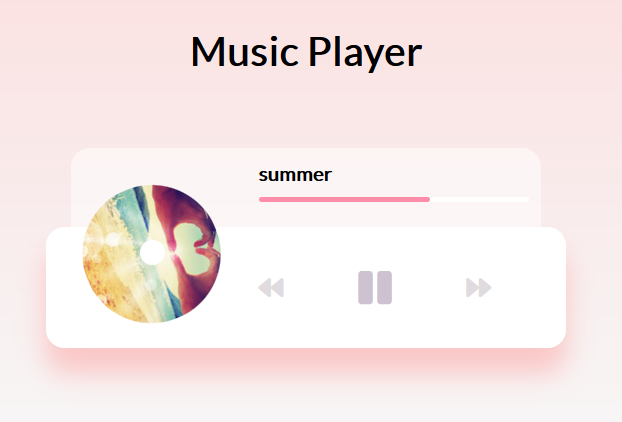

# js-music-player

JavaScript Music Player App

<!-- Live link to deployed app -->

Repository: https://github.com/Mdudzik92/js-music-player 
Deployed app: https://mdudzik92.github.io/js-music-player/

<!-- Technologies used -->

HTML, CSS, JavaScript, Audio

<!-- Explanation of what the app is -->

This is a very cool Music Player app written in JavaScript, HTML and CSS that allows the user to sift through a couple songs, start, pause and change the song to the previous or next song in the array/playlist. This was my first foray into using audio files in an app and I found it very interesting.

<!-- Screenshot -->

<!-- Screencastify Link -->

Screencastify unfortunately did not record the audio for this app, but I encourage the viewer to click the link to the deployed app to check it out for themselves.

https://drive.google.com/file/d/18Su2HS9CYWOs4mk0xddVktSjDol3OsOT/view

<!-- License -->

MIT

<!-- Contact information -->

Email: mdudzik92@gmail.com
